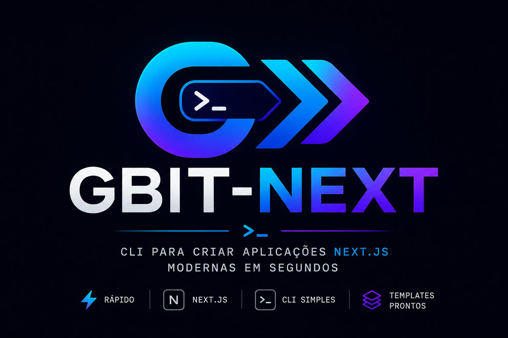
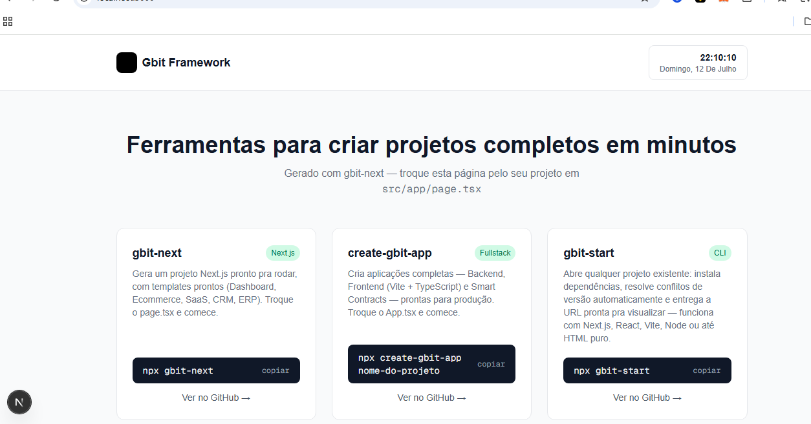

<p align="center">
  
</p>

<p align="center">
  
  
  
  
</p>
                                                   # ⚡ gbit-next
**Crie projetos Next.js completos e prontos pra rodar, em segundos.**

 Templates reais para Dashboard, Ecommerce, SaaS, CRM e ERP — com relógio ao vivo, cotações de moedas em tempo real e pagamento Pix funcional via Mercado Pago.


<p align="center">
  <strong>Create Modern Next.js Applications</strong>
</p>

<p align="center">
  CLI profissional para criar aplicações Next.js modernas em segundos.
</p>


---

## ✨ O que é

`gbit-next` é um CLI que gera um projeto **Next.js + TypeScript + Tailwind** já configurado e pronto pra rodar — sem tela em branco. Escolha um template, e o CLI entrega uma aplicação funcional de verdade: sidebar, componentes, dados de exemplo e (em alguns templates) recursos reais como pagamento via Pix.

Troque o `src/app/page.tsx` pelo seu conteúdo e o projeto já é seu.

## 🚀 Uso

```bash
npx gbit-next
```

O CLI vai perguntar:
1. **Nome do projeto**
2. **Template** desejado

E entrega tudo pronto:

```bash
cd nome-do-projeto
npm run dev
```

## 📦 Templates disponíveis

| Template | O que vem pronto |
|---|---|
| **Dashboard** | Sidebar + cards de métricas — ótimo ponto de partida para painéis administrativos |
| **Ecommerce** | Navbar + grid de produtos com carrinho |
| **SaaS** | Landing page + planos de assinatura + login com Google (UI) + **pagamento Pix real via Mercado Pago** |
| **CRM** | Sidebar + tabela de contatos com status |
| **ERP** | Sidebar + controle de estoque |
| **Vitrine Gbit** | Página de portfólio para suas próprias ferramentas |
| **Blank Project** | Setup limpo (Next + TS + Tailwind), sem nenhum template aplicado |

## 🧩 Recursos inclusos

- ⏰ **Relógio ao vivo** — hora e data atualizando em tempo real
- 💱 **Cotações reais** — BTC, ETH, USD e EUR, atualizadas automaticamente (via CoinGecko + open.er-api, sem necessidade de chave de API)
- 💳 **Pagamento Pix real** *(template SaaS)* — gera QR Code de verdade via Mercado Pago; basta configurar seu Access Token no `.env.local`
- 🔐 **Login com Google** *(UI pronta)* — botão estilizado, pronto para conectar ao NextAuth

## ⚙️ Configurando o Pix (template SaaS)

Ao gerar um projeto com o template **SaaS**, um arquivo `.env.local` é criado automaticamente. Edite-o com sua chave do Mercado Pago:

```dotenv
MERCADOPAGO_ACCESS_TOKEN=sua_chave_aqui
```

> Use uma chave de **teste** (`TEST-...`) para experimentar sem gerar cobranças reais.

## 🛠️ Stack gerada

- [Next.js](https://nextjs.org/) (App Router)
- [TypeScript](https://www.typescriptlang.org/)
- [Tailwind CSS](https://tailwindcss.com/)
- ESLint configurado

## 🗺️ Roadmap

- [ ] Mais templates (Blog, Portfólio, Landing Page)
- [ ] Integração completa com NextAuth (Google login funcional)
- [ ] Suporte a outros provedores de pagamento

## 🤝 Ecossistema Gbit

| Ferramenta | Descrição |
|---|---|
| [`gbit-next`](https://github.com/Gislaine-programadora) | Este CLI — projetos Next.js prontos |
| [`create-gbit-app`](https://github.com/Gislaine-programadora) | Projetos fullstack completos (Backend + Frontend Vite/TS + Smart Contracts) |
| [`gbit-start`](https://github.com/Gislaine-programadora) | Abre qualquer projeto existente, instala dependências e entrega a URL pronta |


<p align="center">
  
</p>

## 📄 Licença

MIT © [Gislaine Cristina Lopes Fernandes](https://github.com/Gislaine-programadora)
